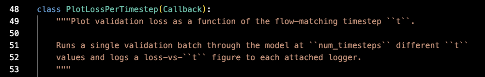

# Contribution [#]: docs(monitoring): narrow PlotLossPerTimestep typing + docstring to surface flow-matching coupling

**Contribution Number:** [1 / 2 / 3]  
**Student:** Avni Girish  
**Issue:** https://github.com/tinaudio/synth-setter/issues/653  
**Status:** Phase II Complete

---

## Why I Chose This Issue

I chose this issue because it is a well-scoped, self-contained task that lives entirely in a single file (`src/utils/callbacks.py`) and focuses on type annotations and documentation rather than changing runtime behavior. It's labeled `good first issue`, comes with exact file and line references, and even includes the maintainer's own explanation of *why* per-timestep loss matters — so there's plenty of context to move quickly without guessing.

It also matches my skills and learning goals well. I'm comfortable with Python and type hints, and this issue lets me ramp up on a real ML codebase (PyTorch Lightning, Hydra, Pydantic) in a low-risk way: I have to understand enough of the flow-matching context to document it accurately, but I don't have to implement model logic. I hope to learn how a research-grade training project is structured, how its callbacks and modules fit together, and how to write a clean, reviewable contribution that follows the project's conventions.

---

## Understanding the Issue

### Problem Description

The `PlotLossPerTimestep` Lightning callback in `src/synth_setter/utils/callbacks.py` silently depends on flow-matching-specific internals of the module passed to it, but nothing in the code or docs makes that dependency visible. The `pl_module` parameter is untyped, the docstring never states that a `KSinFlowMatchingModule` is required, and there is no early guard. The fix is to narrow the type annotations to `KSinFlowMatchingModule` and expand the docstring to document the requirement and the rationale.

### Expected Behavior

Misuse should be caught early and clearly. With `pl_module` annotated as `KSinFlowMatchingModule`, a static type checker (the project ships `pyrightconfig.json`) flags any attempt to use the callback with an incompatible module, and the docstring tells a reader up front that the callback only works with a flow-matching module and why per-timestep loss is worth plotting.

### Current Behavior

`pl_module` is an unannotated parameter, so the type checker cannot warn at authoring time. At runtime the callback reaches `pl_module.encoder(signal)` and crashes with a cryptic `AttributeError: '<Module>' object has no attribute 'encoder'` when given a non-flow-matching module. The docstring describes only what the callback does, not the requirement or the motivation.

### Affected Components

- `src/synth_setter/utils/callbacks.py` — the `PlotLossPerTimestep` class:
  - Class docstring — lines 49-53
  - `_compute_losses(self, trainer, pl_module)` — line 63 (and the flow-matching attribute accesses at lines 68-82)
  - `on_validation_epoch_end(self, trainer, pl_module)` — line 109
- Reference patterns (already annotated/guarded, used as a model): `PlotPositionalEncodingSimilarity` (line 169) and `PlotLearntProjection._do_plotting` (line 296).
- `KSinFlowMatchingModule` is already imported at the top of the file (line 18), so no new import is required.

---

## Reproduction Process

### Environment Setup

Cloned the repo into `synth-setter/`. Because this is a typing + documentation issue with no behavioral bug to trigger, a full training environment (`make install`, Surge VST, etc.) is not needed to reproduce it — the defect is verifiable by code inspection plus reasoning about the type signature and runtime attribute access.

### Steps to Reproduce

1. Open `src/synth_setter/utils/callbacks.py` and locate the `PlotLossPerTimestep` class.
2. Confirm `_compute_losses` (line 63) and `on_validation_epoch_end` (line 109) declare `pl_module` with no type annotation.
3. Confirm the body accesses flow-matching-only internals (`pl_module.encoder`, `.vector_field`, `.hparams.cfg_dropout_rate`, `._sample_x0_and_x1`, `._sample_probability_path`, `._evaluate_target_field`) with no `isinstance` guard.
4. Compare against the sibling callbacks `PlotPositionalEncodingSimilarity` (line 169) and `PlotLearntProjection` (line 296), which both annotate/guard and return early for incompatible modules.
5. Observed result: nothing in the type signature or docstring discloses the `KSinFlowMatchingModule` requirement, so the dependency is invisible to both a static type checker and a reader.

### Reproduction Evidence

- **Branch:** https://github.com/avnigirish/synth-setter/tree/fix-issue-653 — no separate reproduction commit needed; defect is visible in the current state of `main`.
- **My findings:** All three problems from the issue are confirmed in the current code: (1) `pl_module` is untyped, (2) there is no runtime guard, and (3) the docstring omits the flow-matching requirement and the reason per-timestep loss matters.

**Evidence 1 — Unannotated `pl_module` in `_compute_losses`, freely accessing flow-matching-only internals:**

**Evidence 2 — Sibling callback `PlotPositionalEncodingSimilarity` correctly guards with `isinstance(pl_module, KSinFlowMatchingModule)` (the pattern `PlotLossPerTimestep` is missing):**

**Evidence 3 — `PlotLossPerTimestep` docstring makes no mention of `KSinFlowMatchingModule` or why per-timestep loss matters:**

---

## Solution Approach

### Analysis

The root cause is an undeclared contract. `PlotLossPerTimestep` was written against the `KSinFlowMatchingModule` API but typed against Lightning's generic module, so the dependency lives only in the implementation and not in the interface. There is no bug in the happy path — the gap is that the requirement is undiscoverable, which the issue addresses with typing (machine-checkable) and docs (human-readable). Runtime `isinstance` gating is explicitly out of scope per the issue.

### Proposed Solution

1. Annotate `pl_module` as `KSinFlowMatchingModule` in `_compute_losses` and `on_validation_epoch_end` so the dependency is part of the signature and pyright can enforce it.
2. Expand the class docstring to (a) state that the callback requires a `KSinFlowMatchingModule`, and (b) explain why per-timestep loss is worth plotting: the Lightning-aggregated training loss is a Monte Carlo estimate over randomly sampled `t`, so it averages away loss-vs-`t` structure that this plot surfaces.

### Implementation Plan

Using UMPIRE framework (adapted):

**Understand:** `PlotLossPerTimestep` silently requires a `KSinFlowMatchingModule`. Make that requirement explicit through type annotations and an expanded docstring, without adding runtime guards.

**Match:** The sibling callbacks already model the convention — `PlotPositionalEncodingSimilarity` (line 169) and `PlotLearntProjection` (line 296) reference `KSinFlowMatchingModule` directly. The class is already imported at line 18, so no new import or circular-import risk. Follow the project's comment-hygiene rules (lead docstrings with the contract; `:param:` lines must add semantics, not restate types).

**Plan:**
1. Add `pl_module: KSinFlowMatchingModule` to `_compute_losses` (line 63) and `on_validation_epoch_end` (line 109).
2. Rewrite the `PlotLossPerTimestep` docstring (lines 49-53) to state the flow-matching requirement and the Monte-Carlo-averaging rationale.
3. Run the type checker (pyright) and the fast test suite to confirm nothing regresses.

**Implement:** https://github.com/avnigirish/synth-setter/tree/fix-issue-653

**Review:** Self-review against `CONTRIBUTING.md` and `AGENTS.md`: docstring follows comment-hygiene rules, no behavioral change, runtime gating left out of scope as the issue requests, commit message follows the `docs(monitoring): ...` convention.

**Evaluate:** `make test-fast` passes; pyright reports no new errors; manually confirm the annotated signature would flag a non-`KSinFlowMatchingModule` argument.

---

## Testing Strategy

### Unit Tests

- [ ] Test case 1: [Description]
- [ ] Test case 2: [Description]
- [ ] Test case 3: [Description]

### Integration Tests

- [ ] Integration scenario 1
- [ ] Integration scenario 2

### Manual Testing

[What you tested manually and results]

---

## Implementation Notes

### Week [X] Progress

[What you built this week, challenges faced, decisions made]

### Week [Y] Progress

[Continue documenting as you work]

### Code Changes

- **Files modified:** [List]
- **Key commits:** [Links to important commits]
- **Approach decisions:** [Why you chose certain approaches]

---

## Pull Request

**PR Link:** [GitHub PR URL when submitted]

**PR Description:** [Draft or final PR description - much of the content above can be adapted]

**Maintainer Feedback:**
- [Date]: [Summary of feedback received]
- [Date]: [How you addressed it]

**Status:** [Awaiting review / Iterating / Approved / Merged]

---

## Learnings & Reflections

### Technical Skills Gained

[What you learned technically]

### Challenges Overcome

[What was hard and how you solved it]

### What I'd Do Differently Next Time

[Reflection on your process]

---

## Resources Used

- [Link to helpful documentation]
- [Tutorial or Stack Overflow post that helped]
- [GitHub issues or discussions that helped]
